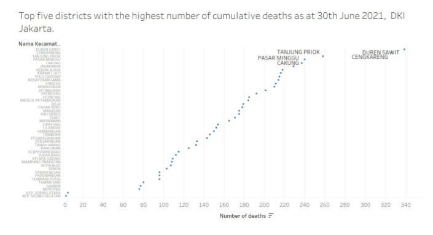
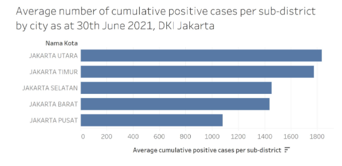
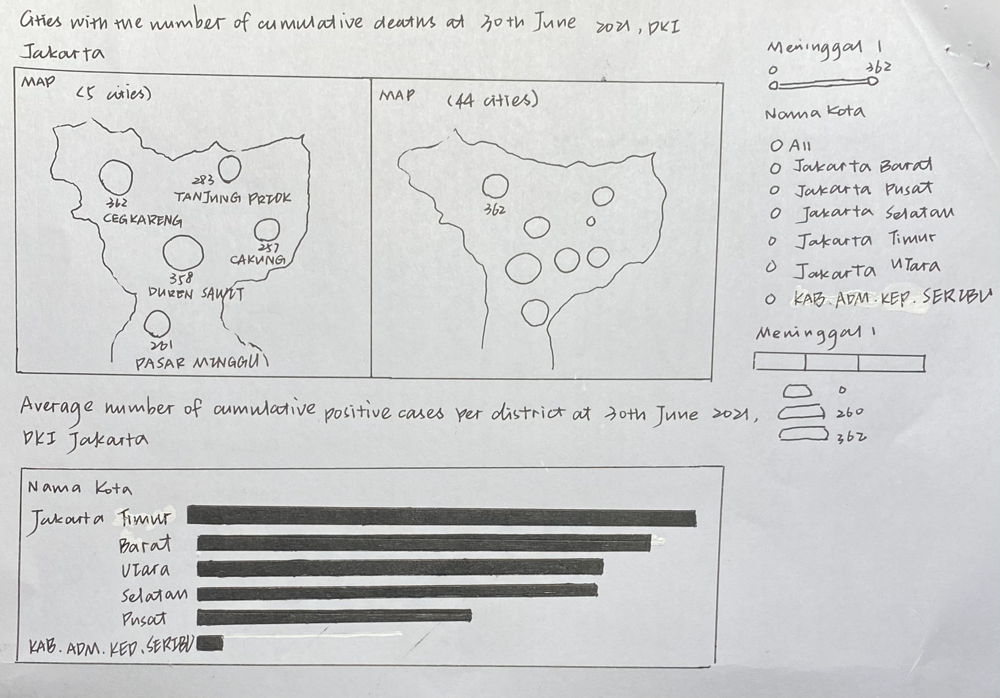

```{r setup, include=FALSE}
knitr::opts_chunk$set(echo = FALSE)
```


# 1.0 Critique of Visualization
The original visualization can be seen below.

The first graph:



The second graph:



### 1.1 Clarity
1. The title of the graph does not convey the intent of the graph well.

The first graph:

* The title indicates the content of the chart is top five districts with the highest number of cumulative deaths, but in fact the chart presents the number of cumulative deaths in all 44 cities.

* These areas in the graph are better to called cities, not districts.
        
The second graph:
    
* The areas in the second graphs are better to called districts.
        
Both two graphs
    
* There should be a connection between the two graphs.

2. The content of the graph

The first graph: data
    
* Maps for charts with geographical information is more appropriate.
        
* It is difficult for readers to get useful information from the graph. Cannot compare the data of each city well.
        
The first graph: annotate
    
* Although the graph is marked name of top five cities, it does not show the exact number of deaths in the five cities.

### 1.2 Aesthetic
The first graph:

* On the y-axis are the names of 44 cities, which are too complicated.

* Comments are too focused and don't provide useful information.

* The choice to use dots as shape leaves too much white space throughout the chart.

# 2.0 Alternative Design
The proposed design is as follows.



### 2.1 Clarity

The first graph:
    
* Use the appropriate chart type. Use the map as the graph background and add dots of the cities cumulative deaths on the map.
        
* Change the title of the graph: "Cities with the number of cumulative deaths at 30th June 2021, DKI Jakarta".
        
* Set the number of cumulative deaths as the color and size of circles in the graph to help readers to compare the cumulative deaths of cities.
        
* Add the districts of DKI Jakarta as the filter, so we can compare the difference cumulative deaths of different districts. And also connect to the second graph.
        
* Use the number of cities cumulative deaths and names of cities as the label to help readers compare.
        
The second graph:
    
* Change the title of the graph: "Average number of cumulative positive cases per district at 30th June 2021, DKI Jakarta".

### 2.2 Aesthetic

The first graph:
    
* Use the appropriate chart type. Use the map as the graph background and add dots of the cities cumulative deaths on the map. It will be easy to read.
        
* Set the number of cumulative deaths as the color and size of circles. Don't leave too much space in the graph.
        
* Use the number of cities cumulative deaths and names of cities as the label.

# 3.0 Proposed Visualization

Please view the interactive visualization on Tableau Public [<font color=grey>*here*.</font>](https://public.tableau.com/app/profile/qian.ziwei/viz/Makeover2_16234698864380/Makeover2)

# 4.0 Step-by-Step Guide

|No|Step| Action |
|--|----|:------:|


