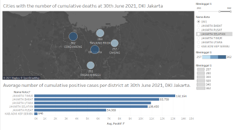
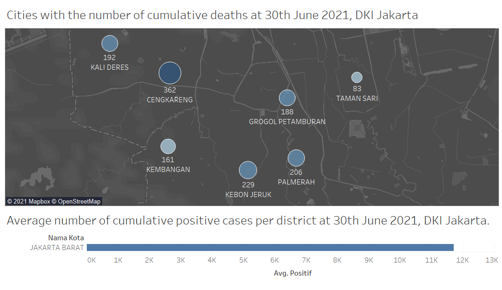

```{r setup, include=FALSE}
knitr::opts_chunk$set(echo = FALSE)
```


# 1.0 Critique of Visualization
The original visualization can be seen below.

The first graph:


The second graph:


### 1.1 Clarity
1. The title of the graph does not convey the intent of the graph well.

The first graph:

* The title indicates the content of the chart is top five districts with the highest number of cumulative deaths, but in fact the chart presents the number of cumulative deaths in all 44 cities.

* These areas in the graph are better to called cities, not districts.
        
The second graph:
    
* The areas in the second graphs are better to called districts.
        
Both two graphs
    
* There should be a connection between the two graphs.

2. The content of the graph

The first graph: data
    
* Maps for charts with geographical information is more appropriate.
        
* It is difficult for readers to get useful information from the graph. Cannot compare the data of each city well.
        
The first graph: annotate
    
* Although the graph is marked name of top five cities, it does not show the exact number of deaths in the five cities.

### 1.2 Aesthetic
The first graph:

* On the y-axis are the names of 44 cities, which are too complicated.

* Comments are too focused and don't provide useful information.

* The choice to use dots as shape leaves too much white space throughout the chart.

# 2.0 Alternative Design
The proposed design is as follows.


### 2.1 Clarity

The first graph:
    
* Use the appropriate chart type. Use the map as the graph background and add dots of the cities cumulative deaths on the map.
        
* Change the title of the graph: "Cities with the number of cumulative deaths at 30th June 2021, DKI Jakarta".
        
* Set the number of cumulative deaths as the color and size of circles in the graph to help readers to compare the cumulative deaths of cities.
        
* Add the districts of DKI Jakarta as the filter, so we can compare the difference cumulative deaths of different districts. And also connect to the second graph.
        
* Use the number of cities cumulative deaths and names of cities as the label to help readers compare.
        
The second graph:
    
* Change the title of the graph: "Average number of cumulative positive cases per district at 30th June 2021, DKI Jakarta".

### 2.2 Aesthetic

The first graph:
    
* Use the appropriate chart type. Use the map as the graph background and add dots of the cities cumulative deaths on the map. It will be easy to read.
        
* Set the number of cumulative deaths as the color and size of circles. Don't leave too much space in the graph.
        
* Use the number of cities cumulative deaths and names of cities as the label.

# 3.0 Proposed Visualization

Please view the interactive visualization on Tableau Public [<font color=grey>*here*.</font>](https://public.tableau.com/app/profile/qian.ziwei/viz/Makeover3_16266269524880/Dashboard1?publish=yes)

# 4.0 Step-by-Step Guide

|No|Step| Action |
|--|----|:------:|
1|Download the *Standar Kelurahan Data Corona (30 Juni 2021 Pukul 10.00)* from the Open Data Covid-19 Provinsi DKI Jakarta website. Load the  excel file into Tableau Prep Builder. Drag the <font color = blue>*'data_kacamatan'*</font> into main pane.|
2|Initiate the cleaning node from <font color = blue>*'data_kacamatan'*</font> data node.| 
3|Under the <font color = blue>*‘Clean 1’*</font> node,remove useless variables.| 
4|Under <font color = blue>*‘Clean 1’*</font> node, filter the rows under <font color = blue>*‘Nama_provinsi’*</font> to choose <font color = blue>*'DKI Jakarta'*</font>.| 
5|Create a <font color = blue>*‘Output’*</font> node after <font color = blue>*‘Clean 1’*</font> node and save output as <font color = blue>*‘Output’*</font>.|
6|Import the data into Tableau.|
7|For chart 1, give the graph title called 'Cities with the number of cumulative deaths at 30th June 2021, DKI Jakarta'.|
8|Drag <font color = blue>*‘Longitude(generated)’*</font> to <font color = blue>*“Columns”*</font> and <font color = blue>*‘Latitude(generated)’*</font> to <font color = blue>*“Rows”*</font>.|
9|Set the <font color = blue>*"Nama Kota"*</font> variable role as <font color = blue>*"State/Province"*</font>.|
10|Set the <font color = blue>*"Nama Kecamatan"*</font> variable role as <font color = blue>*"City"*</font>.|
11|Drag <font color = blue>*"Nama Kecamatan"*</font> which is the name of cities as a layer.|
12|Edit map location.|
13|Under the map location pane, choose the country as "Indonesia".|
14|Because the names of cities in the dataset can not match the names in the Tableau. So enter the longitude and latitude to each city.|
15|Under <font color = blue>*Mark* pane, drag <font color = blue>*'Meninggal'*</font> which means deaths number to <font color = blue>*Color*</font>, <font color = blue>*Size*</font> and <font color = blue>*Label*</font>.|
16|Under <font color = blue>*Mark* pane, drag <font color = blue>*'Nama kecamatan'*</font> which means cities' names to <font color = blue>*Label*</font> and <font color = blue>*Tooltip*</font>.|
17|Under <font color = blue>*Mark*</font> pane, choose the <font color = blue>*circle shape*</font>.|
18|Drag <font color = blue>*"Nama Kota"*</font> which is the name of districts </font> as a layer.|
19|Under <font color = blue>*Mark*</font> pane, drag <font color = blue>*'Nama Kota'*</font> which means districts' names to <font color = blue>*Color*</font>.|
20|Drag <font color = blue>*'Nama Kota'*</font> which means districts' names to <font color = blue>*Filter*</font>.|
21|Choose <font color = blue>*"Show filter"*</font>.|
22|Choose <font color = blue>*"Single Value"*</font>.|
23|Drag <font color = blue>*'Meninggal'*</font> which means deaths number to <font color = blue>*Filter*</font>.|
24|Choose <font color = blue>*"Show filter"*</font>.|
25|For chart 2, give the graph title called 'Average number of cumulative positive cases per district at 30th June 2021, DKI Jakarta.'.|
26|Drag <font color = blue>*‘Positif’*</font> which means the positive cases to <font color = blue>*“Columns”*</font> and <font color = blue>*‘Nama Kota’*</font> to <font color = blue>*“Rows”*</font>.|
27|Drag <font color = blue>*'Nama Kota'*</font> which means districts' names to <font color = blue>*Filter*</font>.|
28|Choose <font color = blue>*"Show filter"*</font>.|
29|Choose <font color = blue>*"Single Value"*</font>.|
30|Create a new dashboard to combine these two graphs.|

# 5.0 Derived Insights

1. Insight 1: The top five cities with the number of cumulative deaths in DKI Jakarta

* The top five cities are: 

CENGKARENG: 362
DUREN SAWIT: 358
TANJUNG PRIOK: 283
PASAR MINGGU: 261
CAKUNG: 257


2. Insight 2: Combine two graphs

From the chart 1, we can see that the Jakarta Timur has the two(CAKUNG AND DUREN SAWIT) of the top five cities with number of cumulative deaths.
At the same, the Jakarta Timur has the highest positive cases(132,154).


Among the six districts, the Jakarta Timur contains most cities.It has ten cities: CAKUNG, PULO GADUNG, MATRMAN, DUREN SAWIT, JAINEGARA, MAKASAR, KRAMAT JATI, CIPAYUNG, CIRACAS and PASAR REBO.


      
3. Insight 3: Combine two graphs

From the chart 1, we can see that the Jakarta Barat has the largest number of deaths city(CENGKARENG).
At the same, the Jakarta Barat has the second highest positive cases(11,720).


The Jakarta Barat contains seven cities: KALI DERES, CENGKARENG, KEMBANGAN, KEBON JERUK, GROGOL PETAMBURAN, PALMERAH and TAMAN SARI.



4. Insight 4: Combine two graphs

From the chart 1, we can see that the Jakarta Selatan has the second largest number of deaths city(CENGKARENG).
At the same, the Jakarta Selatan has the fourth highest positive cases(11,7643). And exCEPt KAB.ADM.KEP.SERIBU, the average positive cases of other five districts are quite similar.


Among the six districts, the Jakarta Selatan contains most cities.It has seven cities: SETIA BUDI, TEBET, PANCORAN, MAMPANG PRAPATAN, KEBAYORAN BARU, KEBAYORAN LAMA, PESANGGRAHAN, PASAR MINGGU, CILANDAK and JAGAKARSA.

